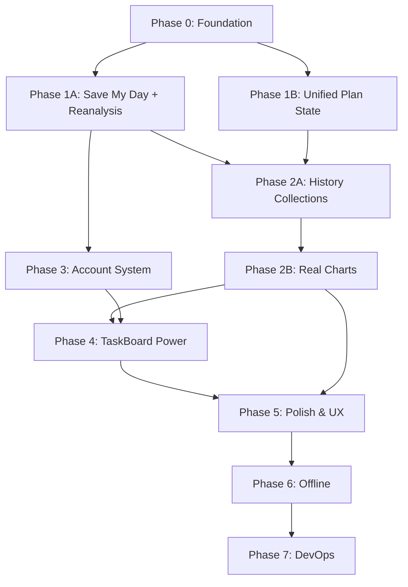

# FlowMind — Comprehensive Improvement Plan

> **Generated from Vision vs Reality Gap Analysis**
> **Based on:** `docs/FlowMind — Complete Product Vision & Project Plan.md` + `FIREBASE_INTEGRATION.md`

---

## 📊 Executive Summary

| Metric | Value |
|--------|-------|
| **Total Estimated Effort** | ~348.5 hours |
| **Phases** | 8 (0-7) |
| **Critical Path** | Phase 0 → 1A → 3 → 2A → 4 → 5 → 6 → 7 |
| **Core Gap** | `ADAPT` phase completely missing (no reanalysis, no Save My Day, fabricated analytics) |

---

## 🎯 Vision vs Reality — Core Gaps

| Vision Principle | Current State | Gap Severity |
|------------------|---------------|--------------|
| Continuous Loop: `UNDERSTAND → PLAN → PRIORITIZE → EXECUTE → TRACK → ADAPT → ⤴` | `ADAPT` phase missing | 🔴 Critical |
| Save My Day (Hero Feature) | Exists in `gemini.js` but **not wired** | 🔴 Critical |
| Single Source of Truth (Firebase) | Multiple plan shapes, independent sync | 🔴 Critical |
| Never Fabricate Analytics | 7-day chart is synthetic | 🔴 Critical |
| Real Historical Data | No `dailyHistory`, `completionLog`, `confidenceHistory` | 🟡 High |
| AI Personality (Calm Coach) | Generic static messages | 🟡 High |
| Account Retention (Guest→Account) | No upgrade flow | 🟡 High |

---

## 📋 Phase Breakdown with Checklists

---

### **PHASE 0: Foundation Stabilization** (Week 1) — *22.5h*

**Goal:** Clean build, 0 lint errors, solid type-safe architecture

| Task | Files | Status | Effort |
|------|-------|--------|--------|
| Fix `setState` in render effects | `AIPlanner.jsx` (3x), `Insights.jsx`, `Dashboard.jsx` | ✅ Done | 8h |
| Fix React Compiler skipped optimizations | `Dashboard.jsx`, `TaskBoard.jsx` | ✅ Done | 4h |
| Normalize plan data model — single Zod schema | Create `src/schemas/planSchema.js`, update all pages | ☐ Pending | 6h |
| Extract plan normalization to shared utility | `src/utils/dashboardMetrics.js` | ☑ Partial | 4h |
| Delete empty utility files | `prompts.js`, `helpers.js` | ☐ Pending | 0.5h |

**Exit Criteria:**
- [x] `npm run lint` → 0 errors ✅
- [x] `npm run build` → success ✅
- [ ] Single plan schema used across all pages

---

### **PHASE 1: Complete the Core Loop** (Week 2-3) — *40h*

**Goal:** Implement missing `ADAPT` phase + wire Save My Day (vision's hero feature)

#### **1A: Save My Day + Reanalysis** (Core Differentiator) — *32h*

| Task | Files | Status | Effort |
|------|-------|--------|--------|
| Create `SaveMyDayModal.jsx` with hours input + AI triage UI | `src/components/SaveMyDayModal.jsx` | ✅ Done | 6h |
| Add "Save My Day" button to Dashboard header | `Dashboard.jsx` | ✅ Done | 2h |
| Wire `generateSaveMyDay(availableHours, currentPlan)` from `gemini.js` | `SaveMyDayModal.jsx` → `gemini.js` | ✅ Done | 4h |
| Apply triage result → update TaskBoard + Dashboard plan | `Dashboard.jsx`, `PlanContext` | ✅ Done | 6h |
| Implement `recalculateAnalysis()` call on task completion | `Dashboard.jsx`, `gemini.js` | ✅ Done (Dashboard) | 8h |
| Add recovery prompt when confidence drops below threshold | `Dashboard.jsx` | ✅ Done | 4h |
| Server-authoritative Success Chance (not local animation) | `Dashboard.jsx`, `PlanContext` | ✅ Done | 2h |

#### **1B: Unified Plan State** — *8h*

| Task | Files | Status | Effort |
|------|-------|--------|--------|
| Single `PlanContext` feeds all pages (Dashboard, Planner, TaskBoard, Insights) | `PlanContext.jsx`, `PlanProvider.jsx`, all pages | ✅ Done | 6h |
| Remove duplicate `subscribeToPlan` in TaskBoard | `TaskBoard.jsx` | ✅ Done | 2h |

**Exit Criteria:**
- [x] Save My Day works end-to-end
- [x] Completing tasks triggers AI reanalysis (Dashboard)
- [x] Confidence score updates from server, not local animation (Dashboard)
- [x] All pages consume single plan state

---

### **PHASE 2: Real Analytics & History** (Week 3-4) — *44h*

**Goal:** Replace fabricated data with real historical tracking

#### **2A: Firestore History Collections** — *18h*

| Task | Files | Status | Effort |
|------|-------|--------|--------|
| Create `historyService.js` for time-series writes | New file | ☐ | 6h |
| Firestore collections: `dailyHistory`, `completionLog`, `confidenceHistory`, `focusSessions` | `firebaseService.js`, `historyService.js` | ☐ | 8h |
| Migration script for existing users | New file | ☐ | 4h |

#### **2B: Real Charts & Time Tracking** — *26h*

| Task | Files | Status | Effort |
|------|-------|--------|--------|
| Real 7-day Productivity Chart — query actual completion data | `Insights.jsx`, `historyService.js` | ☐ | 8h |
| Focus timer persistence — save actual vs estimated time | `TaskBoard.jsx`, `PlanContext` | ☐ | 6h |
| Weekly/Monthly date range picker for Insights | `Insights.jsx` | ☐ | 6h |
| Export/Share — CSV, PDF, shareable link | `Insights.jsx` | ☐ | 6h |

**Exit Criteria:**
- [ ] 7-day chart shows real historical data
- [ ] Time tracking captures actual vs estimated
- [ ] User can filter insights by date range
- [ ] Export produces valid CSV/PDF

---

### **PHASE 3: Account & Profile System** (Week 4) — *30h*

**Goal:** Retention-critical features for user ownership

| Task | Files | Status | Effort |
|------|-------|--------|--------|
| Settings Page — edit name, occupation, goal, hours, preferred time | `src/pages/SettingsPage.jsx`, route in `App.jsx` | ☐ | 10h |
| Guest → Account Upgrade — link email/Google to anonymous UID | `authService.js`, `SettingsPage.jsx` | ☐ | 8h |
| Avatar Upload — Firebase Storage integration | `SettingsPage.jsx`, `firebaseService.js` | ☐ | 6h |
| Delete Account — full cleanup | `authService.js`, `SettingsPage.jsx` | ☐ | 4h |
| SidebarProfile — enable Profile/Account/Preferences links | `SidebarProfile.jsx` | ☐ | 2h |

**Exit Criteria:**
- [ ] Users can edit profile after setup
- [ ] Guest users can upgrade to permanent account
- [ ] Avatar upload works
- [ ] Account deletion cleans all data

---

### **PHASE 4: TaskBoard Power Features** (Week 5) — *42h*

**Goal:** Make execution truly powerful for daily use

| Task | Files | Status | Effort |
|------|-------|--------|--------|
| Subtasks — hierarchical breakdown | `TaskBoard.jsx`, plan schema, Firestore | ☐ | 12h |
| Drag-to-Reorder — manual priority override (`@dnd-kit`) | `TaskBoard.jsx` | ☐ | 10h |
| Focus Timer Persistence — survive refresh, save to plan | `TaskBoard.jsx`, `PlanContext` | ☐ | 6h |
| Task Tags/Categories — filter & group | `TaskBoard.jsx`, schema | ☐ | 6h |
| Recurring Templates — save habit templates | `TaskBoard.jsx` | ☐ | 4h |
| Quick Add from Dashboard | `Dashboard.jsx` | ☐ | 4h |

**Exit Criteria:**
- [ ] Subtasks create/edit/delete work
- [ ] Drag reorder persists to Firebase
- [ ] Timer survives page refresh
- [ ] Tags enable filtering

---

### **PHASE 5: Polish & UX** (Week 6) — *58h*

**Goal:** Premium feel, accessibility, mobile support

| Task | Files | Status | Effort |
|------|-------|--------|--------|
| Dark Mode — full theme support (Tailwind 4 `dark:`) | `index.css`, all pages, `SidebarProfile` | ☐ | 12h |
| Keyboard Shortcuts — `Cmd+K` palette, `Space` complete, `/` search | New `useKeyboardShortcuts` hook, all pages | ☐ | 10h |
| Mobile Responsiveness — Sidebar drawer, touch cards, calendar swipe | `MainLayout.jsx`, `Sidebar.jsx`, all pages | ☐ | 12h |
| Loading Skeletons — all async operations | All pages | ☐ | 6h |
| Error Boundaries — per-section graceful degradation | New `ErrorBoundary.jsx`, all pages | ☐ | 6h |
| Accessibility — ARIA, focus management, contrast audit | All pages | ☐ | 8h |
| Reduced Motion — respect `prefers-reduced-motion` | Global CSS, animation components | ☐ | 4h |

**Exit Criteria:**
- [ ] Dark/Light toggle works everywhere
- [ ] Keyboard shortcuts functional
- [ ] Mobile layout usable (no horizontal scroll)
- [ ] All async states have skeletons
- [ ] No console errors on error boundaries

---

### **PHASE 6: Offline & Data Integrity** (Week 7) — *40h*

**Goal:** Production-grade reliability

| Task | Files | Status | Effort |
|------|-------|--------|--------|
| Service Worker — cache assets, offline read | `public/sw.js`, `vite.config.js` (PWA plugin) | ☐ | 8h |
| IndexedDB Cache — local-first writes, sync when online (Dexie.js) | New `offlineService.js`, `PlanContext` | ☐ | 12h |
| Conflict Resolution — last-write-wins + merge UI | `PlanContext`, `firebaseService.js` | ☐ | 8h |
| Migration System — versioned schema migrations | New `migrationService.js` | ☐ | 6h |
| Backup/Restore — user-initiated export/import | `SettingsPage.jsx`, `firebaseService.js` | ☐ | 6h |

**Exit Criteria:**
- [ ] App loads offline (cached assets)
- [ ] Writes queue locally, sync when online
- [ ] Conflict resolution UI appears on sync conflicts
- [ ] Schema migrations run automatically
- [ ] User can export/import full data

---

### **PHASE 7: DevOps & Quality** (Week 8) — *72h*

**Goal:** Sustainable development workflow

| Task | Files | Status | Effort |
|------|-------|--------|--------|
| TypeScript Migration — incremental (new files TS, migrate on touch) | All `*.jsx` → `*.tsx` | ☐ | 20h |
| Unit Tests — Vitest (utils, hooks, services) | `src/**/*.test.ts` | ☐ | 16h |
| E2E Tests — Playwright (critical flows: auth→setup→plan→execute) | `e2e/**/*.spec.ts` | ☐ | 16h |
| CI/CD — GitHub Actions: lint → typecheck → test → build → deploy preview | `.github/workflows/ci.yml` | ☐ | 8h |
| Bundle Analysis — code-split by route, chunk optimization | `vite.config.js`, `React.lazy` | ☐ | 6h |
| Error Monitoring — Sentry integration | `main.jsx`, `App.jsx` | ☐ | 4h |
| Analytics — Privacy-friendly (Plausible/Umami) | `index.html`, `App.jsx` | ☐ | 2h |

**Exit Criteria:**
- [ ] TypeScript strict mode passes
- [ ] Unit tests > 80% coverage on utils/services
- [ ] E2E covers auth, planner, task completion
- [ ] CI pipeline green on main
- [ ] Bundle size < 500KB gzipped per chunk
- [ ] Sentry captures production errors

---

## 📈 Phase Dependency Graph

---

## 🎯 Recommended Execution Sequence (Pragmatic)

| Week | Focus | Rationale |
|------|-------|-----------|
| 1 | **Phase 0** | Clean slate — no lint/build blockers |
| 2 | **Phase 1A** | Core differentiator — Save My Day + Reanalysis = vision's promise |
| 3 | **Phase 3** | Retention — guest upgrade + settings = user ownership |
| 4 | **Phase 2A + 2B** | Credibility — real analytics replace fabricated data |
| 5 | **Phase 4** | Power users — subtasks + drag reorder = daily delight |
| 6 | **Phase 5** | Polish — dark mode + mobile + shortcuts = premium feel |
| 7 | **Phase 6** | Reliability — offline + conflict resolution = production ready |
| 8 | **Phase 7** | Sustainability — TS + tests + CI = long-term velocity |

---

## ❓ Decisions Needed Before Start

| Decision | Options | Recommendation |
|----------|---------|----------------|
| **TypeScript approach** | Full now / Incremental / Skip | **Incremental** — new files `.tsx`, migrate on touch |
| **Testing priority** | Unit first / E2E first / Both | **Unit first** (utils/services) → E2E for critical flows |
| **Mobile support** | Phase 5 / Earlier / Skip | **Phase 5** (desktop-first, responsive polish) |
| **Offline scope** | Full PWA / Basic IndexedDB / Skip | **Basic IndexedDB** (queue writes, sync online) |
| **Team size** | Solo / 2-3 / 4+ | Affects parallelization — solo = sequential |

---

## ✅ Definition of Done (Per Phase)

Each phase is complete when:
- [ ] All checklist items ✅
- [ ] `npm run lint` → 0 errors
- [ ] `npm run build` → success
- [ ] Manual QA passes for new features
- [ ] No regression in existing flows

---

## 📝 Notes

- **Vision Reference:** `docs/FlowMind — Complete Product Vision & Project Plan.md` (sections 4, 8, 10, 11, 12, 14, 16)
- **Firebase Reference:** `FIREBASE_INTEGRATION.md` (current hybrid storage architecture)
- **Current Build:** ✅ Passing (after Phase 0 fixes)
- **Current Lint:** ⚠️ 11 errors (pre-existing, Phase 0 will fix)

---

*Generated: $(date)*
*Status: **READY FOR REVIEW** — awaiting approval to begin Phase 0*